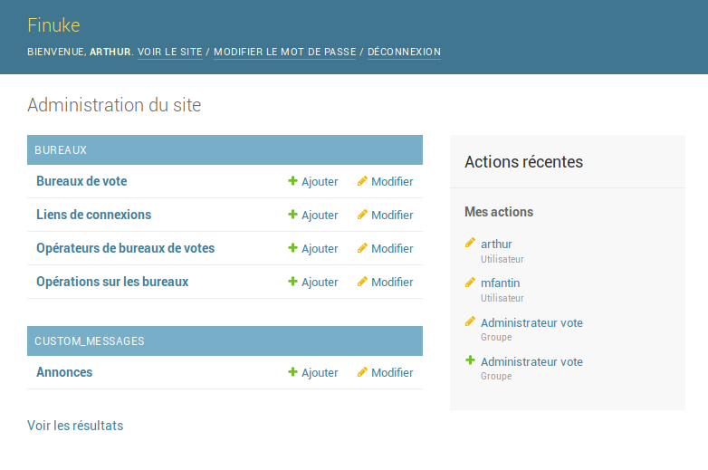
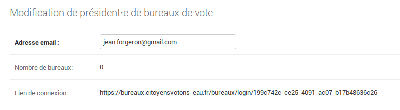

Les administrateurs
===================

Le rôle des administrateurs est la supervision des opérations de vote,
à l'exception des aspects techniques. Ils gèrent les accès des
présidents de bureaux de vote et font le suivi des opérations de vote.
Pour cela, ils accèdent à l'interface d'administration de l'application,
qui leur permet notamment :
- de gérer la liste des présidents de bureaux de vote, d'en ajouter ou
  d'en supprimer
- de leur transmettre leurs liens de connexion
- de vérifier le bon déroulement des opérations de vote en contrôlant
  l'organisation des bureaux, et la remontée des résultats
- D'avoir un aperçu de la participation et des résultats globaux

L'interface d'administration
----------------------------

### Localisation de l'interface

L'interface d'administration est accessible à l'URL `/admin` de
l'application. Par exemple, si l'application est hébergée sur le nom
de domaine `bureaux.votation.fr`, l'interface d'administration sera
accessible via l'url `https://bureaux.votation.fr/admin`

### Vue d'ensemble de l'interface

L'écran d'accueil permet l'accès à l'ensemble des fonctionnalités
décrites ci-dessus.

### Gestion des présidents

La section **présidents de bureaux de votes** permet d'ajouter, de
modifier ou de supprimer des présidents.

#### Ajouter un président de bureaux de vote

Pour ajouter un président, il suffit de saisir une adresse email. Cette
adresse email sert pour l'instant uniquement à identifier l'opérateur
concerné et n'est pas utilisé directement par l'application.

#### Obtenir le lien de connexion pour un président de Bureau de vote

À partir de la liste des Présidents de bureau de vote, on obtient le
lien de connexion d'un président en cliquant sur son email.

Ce lien est la seule information de connexion dans le président de
Bureau de vote a besoin.

#### Supprimer ou désactiver un président de Bureau de vote

Un président de bureau de vote peut être supprimé de l'interface tant
qu'il n'a pas encore organisé de bureau de vote. *Une fois, qu'il a
organisé un bureau de vote, il n'est plus possible de le supprimer*.

Toutefois, il reste toujours possible de le désactiver, en décochant la
case *Compte actif* trouvable sur la page de modification du président
en question.

### Suivre l'activité des bureaux

La section **Bureaux de vote** vous permet de suivre l'activité des
bureaux.

Un filtre sur la droite permet de classer les bureaux par statut, pour
vérifier que les bureaux ont été correctement fermés et leurs résultats
remontés. Chaque bureau indique directement qui en est le président.

Il est fortement **déconseillé** d'ajouter, de modifier les bureaux ou
de supprimer des bureaux de vote depuis cette interface.

### Suivre la participation et les résutats

Un lien placé en bas de la page principale de l'interface
d'administration permet d'accéder à un tableau résumé de la
participation et des résultats de la campagne de vote.